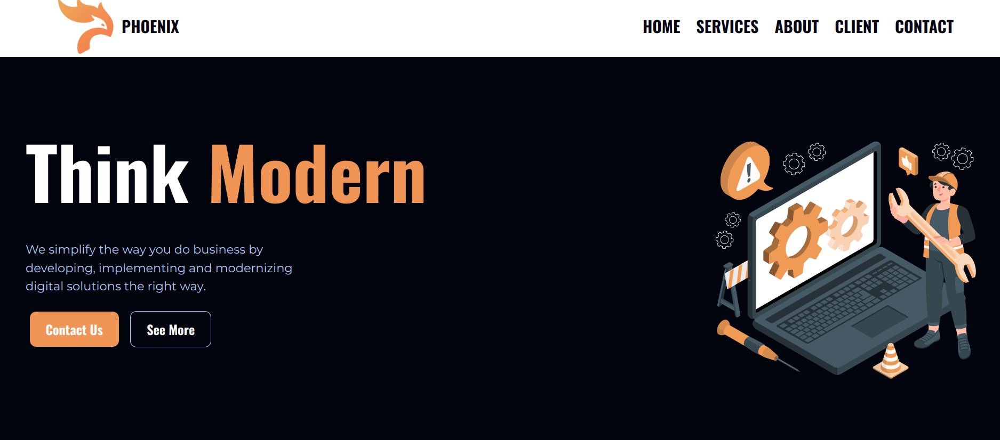

# Proyecto de Sitio Web de Agencia Web

Este repositorio contiene el código fuente y los recursos necesarios para **un proyecto que nos dio la plataforma Nucba** sobre el desarrollo de un sitio web de una agencia web. El objetivo de este proyecto es crear una plataforma en línea donde la agencia pueda promocionar sus servicios y mostrar su experiencia en el desarrollo de sitios web de alta calidad.

## Funcionalidades

- **Página de inicio**: Presenta una visión general de la agencia y sus servicios destacados.
- **Servicios**: Detalla los servicios ofrecidos por la agencia, junto con información adicional sobre cada uno.
- **Nosotros**: Permite conocer al equipo de la agencia y su experiencia, presentando breves biografías de los miembros clave.
- **Contacto**: Proporciona un formulario de contacto para que los visitantes puedan comunicarse directamente con la agencia.

## Tecnologías utilizadas

- **HTML5 y CSS3**: Para la estructura y el diseño del sitio web.